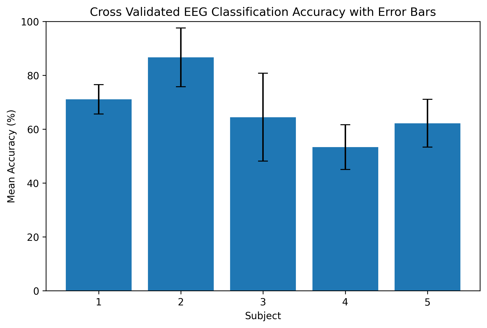
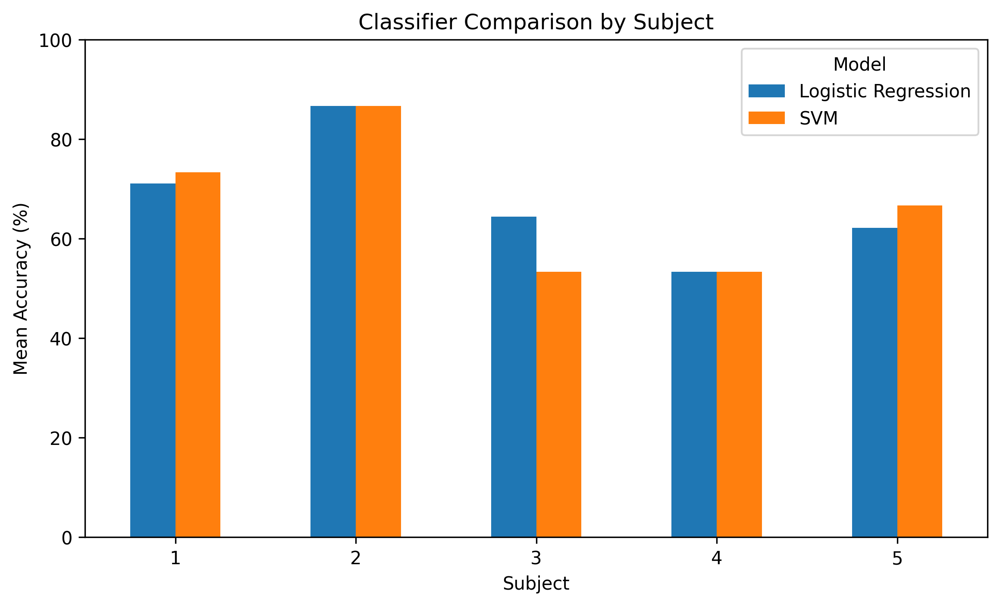
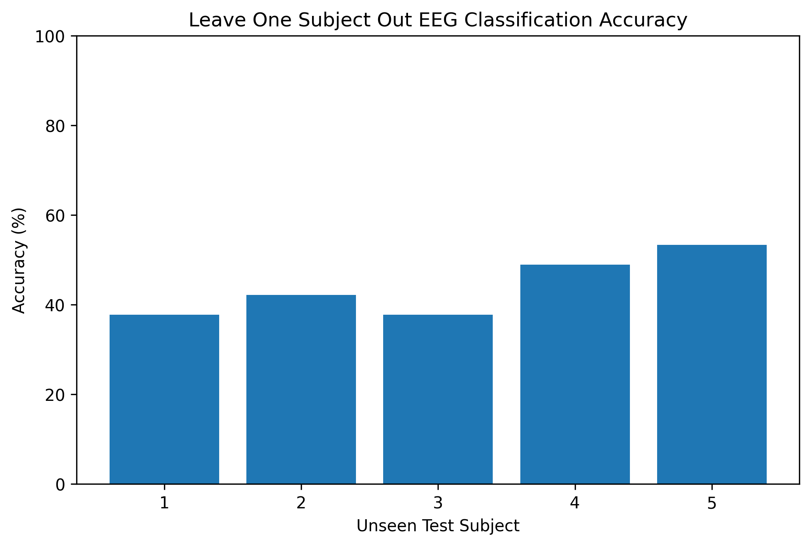
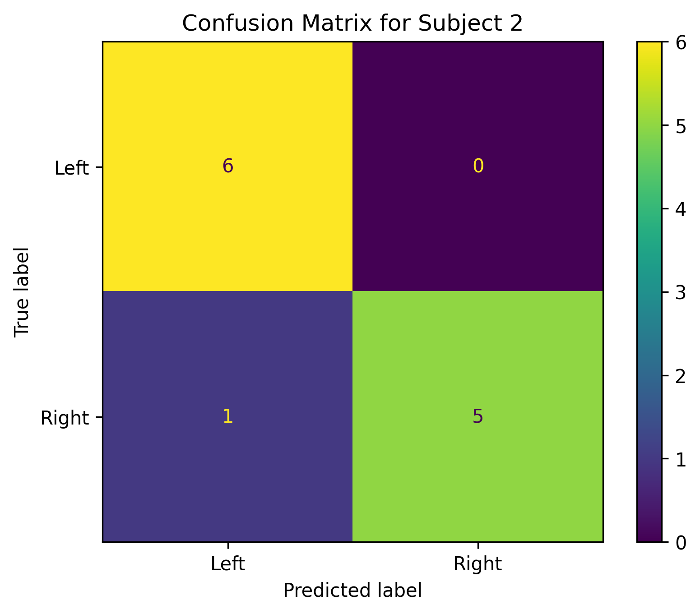
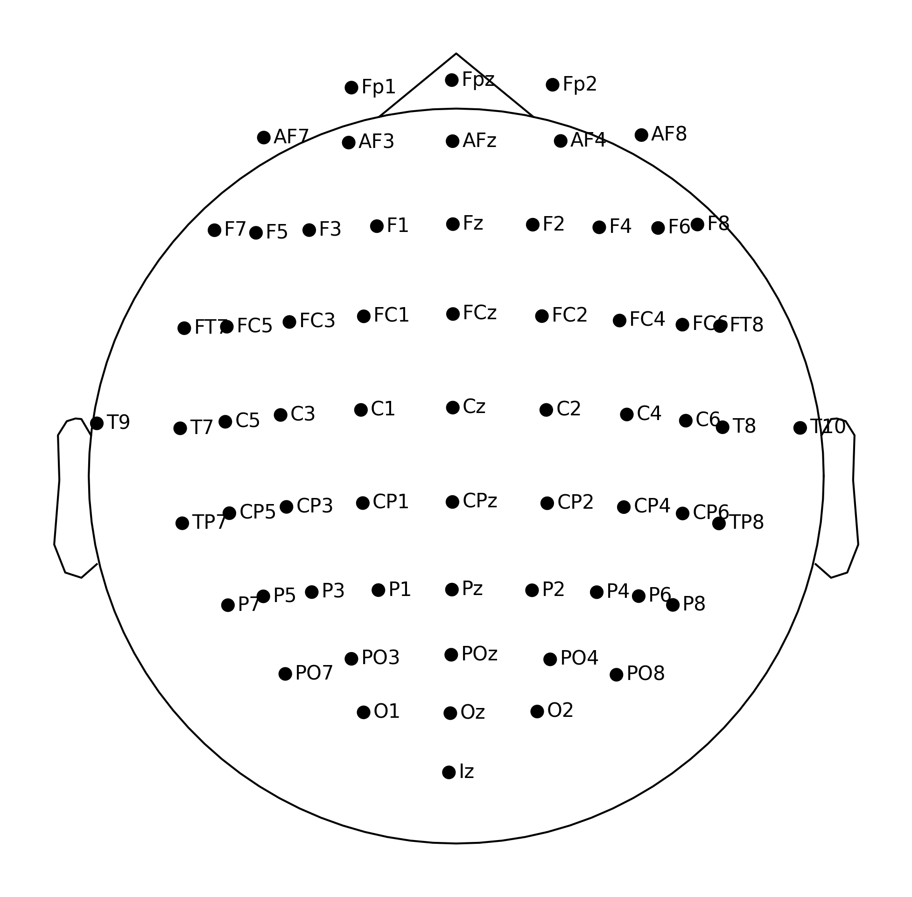
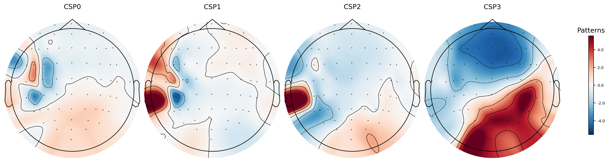

# Motora: EEG Motor Imagery Classifier

Motora is a neurotechnology project I built to explore whether EEG brain signals can be used to classify imagined left hand movement versus imagined right hand movement.

I wanted to create a hands on project that combined neuroscience, signal processing, and machine learning using real public brain signal data.

## Why I Built This

I recently had a surge of interest and curiosity in neurotechnology and brain computer interfaces, and I wanted to do something hands on instead of only reading or watching videos about the field.

I wanted to see what it would actually be like to work with real EEG brain signal data and build a basic machine learning workflow from start to finish.

My goal was to create an accessible EEG machine learning project that helped me understand how raw brain signals can be loaded, processed, visualized, and used to train models for brain state classification.

## Project Overview

This project uses public EEG recordings from the EEGBCI motor imagery dataset.

The main task was to classify between two imagined movement conditions: 

1. Imagined left hand movement
2. Imagined right hand movement

I processed the EEG data, extracted motor imagery epochs, trained machine learning models, compared different evaluation methods, and visualized the brain signal patterns used by the classifier.

## Tools Used

- Python
- Google Colab
- MNE Python
- NumPy
- Pandas
- Matplotlib
- Scikit-learn

## Methods

I used MNE Python to load and process public EEG recordings.

The analysis focused on runs 4, 8, and 12, which contain imagined left hand and imagined right hand movement tasks.

The EEG signals were filtered between 7 and 30 Hz to focus on frequency ranges commonly used in motor imagery EEG analysis.

The filtered signals were then segmented into epochs from 1 to 4 seconds after each task cue.

I used Common Spatial Patterns to extract spatial EEG features and trained machine learning classifiers to predict the imagined movement condition.

## Models and Evaluation

I tested several approaches:

- Single subject classification
- Multi subject classification
- Subject specific cross validation
- Logistic regression
- Support vector machine
- Leave one subject out testing
- Confusion matrix analysis
- EEG electrode and CSP pattern visualization

## Key Results

- The first single subject model achieved 66.67 percent accuracy.
- The five subject combined model achieved 52.63 percent accuracy.
- The strongest subject specific result was Subject 2, which reached 86.67 percent mean cross validated accuracy.
- In a single train test split, Subject 2 classified 11 out of 12 test trials correctly.
- Leave one subject out testing ranged from 37.78 percent to 53.33 percent accuracy.

## Visual Results

### Cross Validated Accuracy with Error Bars

### Classifier Comparison

### Leave One Subject Out Accuracy

### Confusion Matrix for Subject 2

### EEG Electrode Map

### CSP Pattern Visualization

## Main Finding

The biggest finding from this project was that subject specific EEG models performed much better than models tested on completely unseen participants.

This suggests that EEG based brain computer interface systems may require individual calibration before they perform well.

In other words, the model could learn useful patterns from a person’s own EEG data, but it struggled when trying to generalize to a completely new person.

## Visualizations Included

The notebook includes:

- Raw EEG signal plot
- Subject specific accuracy comparison
- Cross validated accuracy graph with error bars
- Classifier comparison graph
- Leave one subject out graph
- Confusion matrix for the best performing subject
- EEG electrode map
- CSP spatial pattern visualization

## What I Learned

Through this project, I learned how to work with real EEG data, preprocess brain signals, extract motor imagery epochs, apply Common Spatial Patterns, train classifiers, compare model performance, and interpret EEG based machine learning results.

I also learned that neurotechnology models are not only about achieving high accuracy. Evaluation method matters, and generalizing across different people is one of the major challenges in EEG based classification.

## Future Improvements

Future versions of Motora could include:

- Testing more subjects
- Using more EEG runs
- Comparing additional machine learning models
- Trying deep learning approaches
- Building a simple web app interface
- Testing other EEG tasks, such as eyes open versus eyes closed
- Exploring live EEG hardware in the future

## Conclusion

Motora demonstrates a full beginner neurotechnology workflow using public brain signal data.

The project shows that EEG motor imagery classification is possible using free public data and basic machine learning methods, while also highlighting an important challenge in neurotechnology: models often perform better within individual participants than across new unseen participants.
